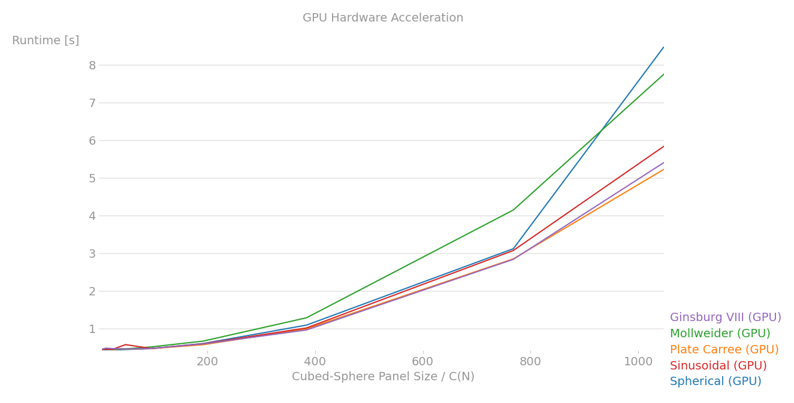
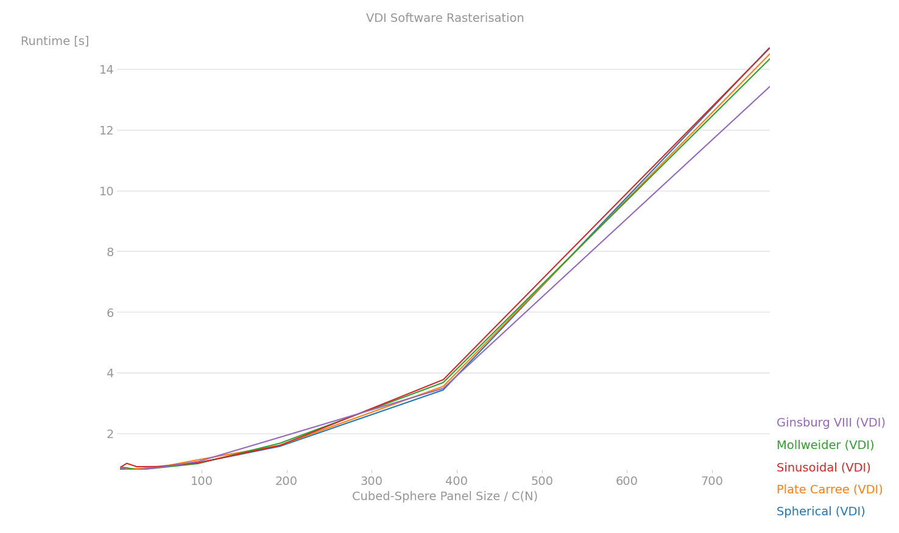
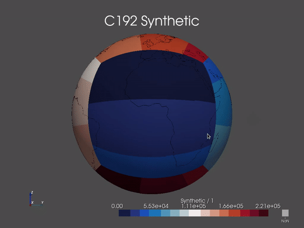

# bench

----

Benchmark:
* (†) - Mesa DRI Intel(R) HD Graphics 4000 (IVB GT2), 3.0 Mesa 20.0.8
* (‡) - SVGA3D, 3.3 (Compatibility Profile) Mesa 18.3.4

  
  <h5 align="center">Figure 1: GPU(†) Planar and Spherical Projection Benchmarking</h5>

----

  
  <h5 align="center">Figure 2: Software Rasterizer(‡) Planar and Spherical Projection Benchmarking (1MB Video Memory)</h5>

----

  
  <h5 align="center">Figure 3: GPU(†) C768 Cubed-Sphere Interactive Render</h5>

----

  
  <h5 align="center">Figure 4: Software Rasterizer(‡) C192 Cubed-Sphere Interactive Render (1MB Video Memory)</h5>

